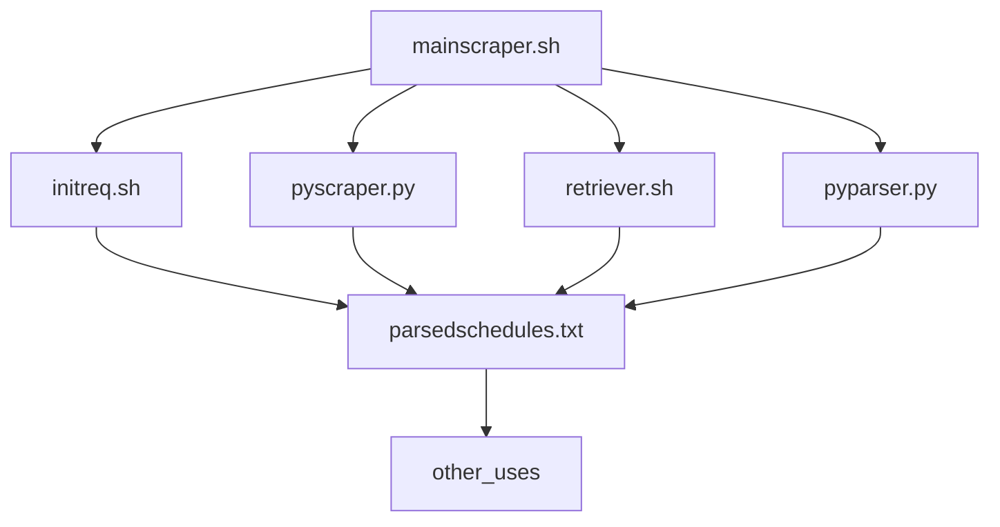

# Dependencies
- Bash, preferably WSL if you're using Windows(Git Bash and MSYS2 didn't work for me)
- Python 3(Must be usable as a command from Bash)

# How to use
Place a userinfo.txt file next to the mainscraper.sh file.
The userinfo.txt file should consist of only 2 lines,
the first line should contain the username and the second line should contain the password. 

Then run the mainscraper.sh file. This will produce the parsed output in parsedschedules.txt

# How it works
mainscraper.sh calls the 4 other scripts to perform the tasks of scraping and parsing, the final result of all the scripts is then placed in parsedschedules.txt

parsedschedules.txt can then be used as the main formatted information source for any server or other application.  

